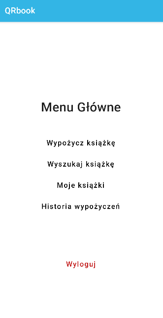
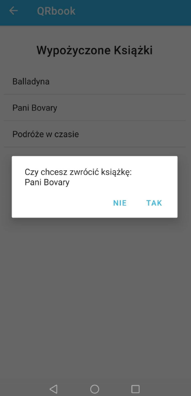
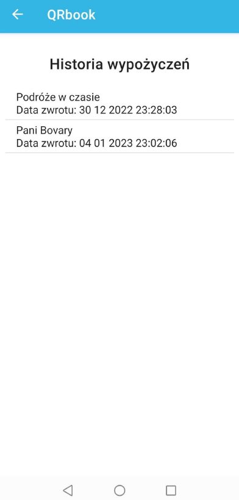
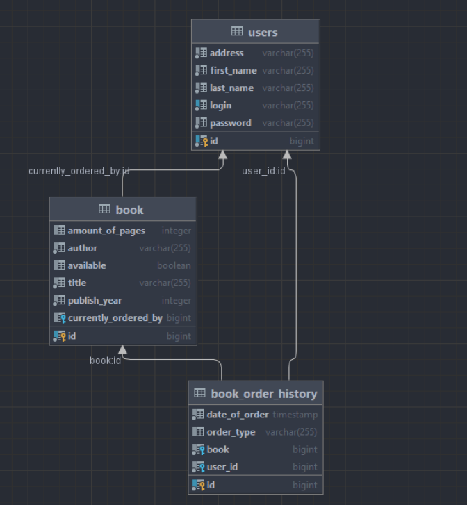

# QRBook 📲📖
QRBook is a mobile application in the Kotlin language that facilitates borrowing books from the library. The user can easily reserve a book in the system by scanning the QR code on a book. The application connects to a local server with a database to access and update information about borrowed books. Each request from the application (borrowing or returning a book) must be accepted (or rejected) by the person managing the library. This is done via a window application written in Java.

## Application:
* __Login page__: allows the user to log in to the application or create an account if they do not already have one

  

* __Register page__:

  

* __Main page__: After successfully logging in, the user is transferred to the main menu where he can borrow a new book (using the qr code), search for a book available in the library, return books, see the history of the books he borrowed or log out of the application

  

* __QR Code scanner page__: After clicking on the "camera" button, the camera will be turned on to scan the qr code

  

* __Availability of books__: If the book is available, a button appears for the user to borrow it. If the code of an already owned book is scanned, the user can return his book. If the book turns out to be occupied, the user can only return to the previous page of the application.

  

* __Search page__: The user has the option of checking which books are available based on the title, author or year of publication of the book.

  

* __Return page__: Allows to return one of the borrowed books

  

* __History page__: The user can check what books he borrowed in the past and when he returned them

  

## Server: 
Mediates between the application and the librarian's application. He is responsible for transferring and updating data on borrowed books.
* __Database schema__:

  

## Panel for the librarian: 
Allows to display information sent by the server to the librarian in a simple way and gives the option of accepting or refusing to borrow a certain book by the application user.

  

